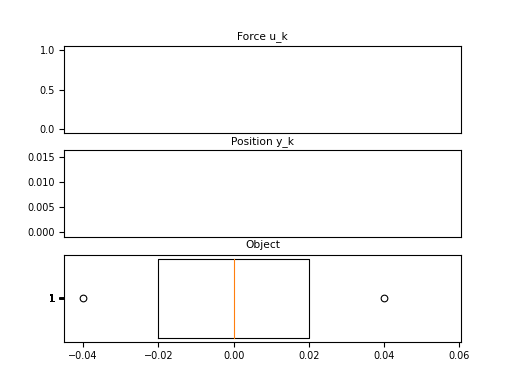
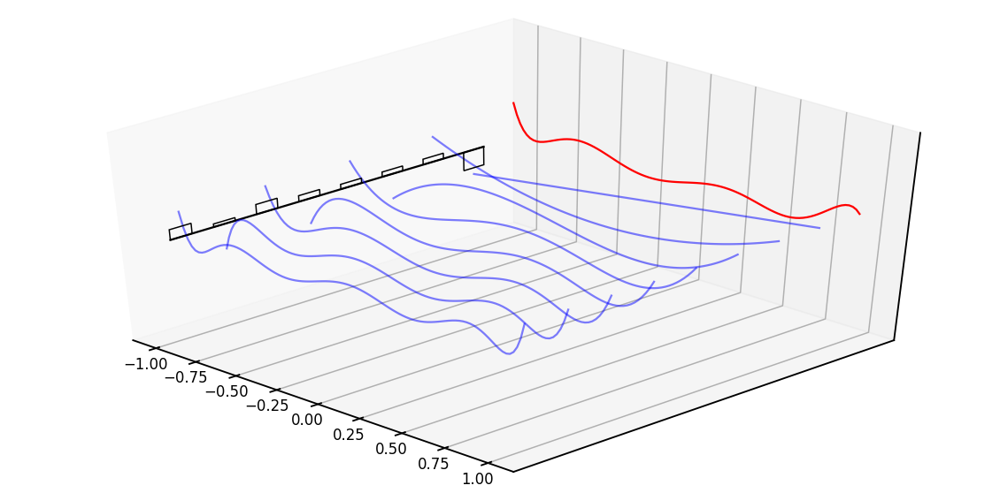

<style>
section.centered {
text-align: center;
}
img {
  display: block;
  margin-left: auto;
  margin-right: auto;
}
</style>


# Generating Extremely Long Sequences in JAX


[Sasha Rush](http://rush-nlp.com/) (@srush_nlp) with [Sidd Karamcheti](https://www.siddkaramcheti.com/)


[https://github.com/srush/annotated-s4](https://github.com/srush/annotated-s4)

Based on research by Albert Gu, Karan Goel, and Christopher Ré.


---

# Intro

---


## Intro


- Professor at Cornell / Researcher at Hugging Face
- Open source projects

   - [Named Tensors](https://nlp.seas.harvard.edu/NamedTensor), [Annotated Transformer](https://nlp.seas.harvard.edu/2018/04/03/attention.html), [Miniconf](https://github.com/Mini-Conf/Mini-Conf), [MiniTorch](https://minitorch.github.io/)


---


## Talk Goals

Caveat: Not a research talk, there will be bugs 🧑‍🔬


* 
   1. Learn about a new ML architecture. 
   2. Understand how JAX supports it.

---

## JAX: Pros and Cons


### Cons

* 
  - Debugging is still hard
  - No NN standard
  - Hard to reason about (for me)

### Pros

*
  - Seperate math from NN (facilitates testing)
  - JIT is really impressive
  - Lifted transformations are magic

---

# Problem Context

---

## Sequence Modeling

Birds-Eye: Learning over a list of elements (discrete or sampled signal) 

* Classification

  > Is the dog a good boy?
  > - Yes

* Generation

  > The dog is a good _____

---

## The Transformer


---

## Transformer Dominance


[isattentionallyouneed.com](http://www.isattentionallyouneed.com/)

---

## The Transformer Weakness 


- Scales $O(L^2)$ with length $L$.


---

## Recurrent Neural Networks (RNN)


- Scales $O(L)$ with length $L$.


---

## Long Range Arena

- A benchmark of extremely long sequence tasks (up to 16k tokens)


---

## Linearized Images

![height:300px](data:image/png;base64,iVBORw0KGgoAAAANSUhEUgAAAUsAAACYCAMAAABatDuZAAAA8FBMVEX///8wMC+NjY3o6OhnZ2bu7u51dXWGhoaQkJAoKCZiYmF7e3vz8/NbW1va2tpsbGuioqIhISA2NzZPT06QmJ4AAACrs7uvr6/Hx8f08OjAyNDa4OZJSUkZGhgUFRY/Pz7e2NLNxbyZo6zt5Nuzqp+dlo/O1Nq/tq28vLmqoJWZmZl0aWCtqaVkX1qLhXt6ho1qdHuCdmhSY20NCABFWGM2S1dZUktNW2tBRkzt9f5dZXNDPTY4MCYpPkgeKjdoXEspMTdMPCoMIDIaAABdUD4AAA0qOU4vFwAkGw0+MSEuICgkExweAxFALRIAECoGEx9ZrLY7AAAPoUlEQVR4nO2dCXvauNqGjYUQGMnBwTZeWLxg9mBISpIm6TKd/TvL9///zXlfsxmcmaY9XCXt0TOBDPeIa+C+hKSX1pKiyMjIyMjIyMjIyMjIyMjIyMjIyMjIyMjIyMjIyMjIPBvaOF1a534zZ47e0I/TGBWQ6hRQvUD0i3O/mTNHb1FyGNpyCmiiFxAjx6H1c7+ZM+dZlwVLE72ApMtCpMvTBVxmnvay8DN+jMDlMWKkgKRL/nNK6djadU9wyS1Ac4vnXAaWTemHFc25DCyP8l/uqHS5Cbh86lF++/HA5dM9B3TgsvbA3ae7A5e1BY2fHqTLbcDl/829YNGjJJNCM5cZuuQ7BC7vbmm/ekfpFoHLh0dAD3skXfJ/BOnYu+RBA5U0BujyH2E690qcjkCTPlm7HNsf9DvewrlKb2Qu7xLvdoOo06DSZYv/U+m1eYncDxeUXjltdPlP3uvxGp+/A0tt55qDy1XcvIvvhunYpIAeOLoMxF380I8SmwbX/ZRLl9zi8wduhBEXlAo+H+Dcw5cP/FfONUqClF9hv/xN+VcUr3SeRBQRulwpv9vBiga3Hu3bXEiXLQrDIiUcXXIulLkP68s1IlSjNF4oV9Av4TH+kCubg0sFXcIjDj8ODVMuXSr5tXo7MUNvPmny/VodumlCbycLvl2r0/lCHa3Rdq1O+4u5nejNeSRd7usehw496hzWPTTxgefqHl0nCUW0q3uoDh/8DEmXsoY8VaTL00W6PF1gTUQPA3MPPUYNvYDUY0Ll3CPYccoV9Yiool5o1SwQ1j73mzlz9J52nLYooN4zqEC0y3O/mTNH75WP0xQF1NOKqEDK0qV0eaqAy8xTTha4xEdaDoHLAioXkHSpNVi5XJntnTTFReOirLFEy7lco0kOlTOk5lpJl0IJhOYpIudyoQw1Qd096q3R2zzSUqUPKBbS5Sbokl4Jyq/yLrmb3fIueZzd8i6PkXQpFG+cBlzTxGbcBJeuv7RHrtgNpT2Rxv7UHsVi1wpcxnTqARJbJF0KZRF4c+XW1ivlsrCnmctoSOuuECMwJFpX6NK1+4gc/WKDwCWiWAwcUIlNpUuhtClvgtAFjJu2snZ5rcTXbnOAXdNT1i4BLWJ7bIbaGoHLByUAlERDTfOhqXQpqLDDJjGHTSLKws9cxs1BH9QiyRCMl0HTH6Ntf6yVhZ65BJQATxWYy7GpdFkWuEgUZnhPYDTMXAISGt4R/IUutQ1KyVwgv8L15Rq1pqAYm0qX2/pFEDKOxhuXOya8pdCnu7pH84g+Gyyzfrlpo5mEJIOpdJmvIaFvmXOcpnM1pNBaU/gP+xpSg1m7Vc7Qto0GK4A1ki7L+6wLwoN6XNssJouoXEDSZfk48ruNr4x0ebrovYsjIxdNUUA9rYgKKi96534zZ45ulY5TqxWQUSDPoc6538yZI12eLtLl6SJdni7gMlOX8wcuj5GxflQronwr6bJW7pVKvfLeSa12eXFZKrWv9sio3U8eS7XFPIdKlxfwqylq0uUmunWjhF3DVjo5lytlbNz4bjfn8g2it3EeXStz44bmkHR5o9A/uvTQJY+t9/xA3BsaWyt66JIH3RXcpMtN0KW9vAt4p4azSc2oocvY/8kcgbjaBoFLQPYs7hrovNZBdB3Q36NW0DXWT5Qu0eVdYC/5zWIEI+LD6KoGLl1z7Au3e1MFswtA6DId0/v4/x3nsWSY+hLQdRzNqYh/bc3ArAnPli5vFItSS3kXL4LOe7cHHRRcwif8vWsNYMh8797TDrh0PynBO7C3CDurwEJ0Ha9osIqjcTTuLMKHoCtddhXLDiyeji3SvXx8IJlLyx+/c7uW3i1dPi5iELcKLW/+Lux+9GEu70ahgS6tt/M3sbXg01qvFg0N6bLULcEgaC36FrFu7NEfuIrsljoG3HVJ1+h6wxtcTBolGCS71+S223nvJxY8rkEDo2axP69Dq6YDki43k/B76o3TquI4T/sVeZdYdgVQbVvkGLauJ16dOoGxRTUzGMxHkevMZL/c1ZA10U2XHSx6cst2o/GTAY93BaPR6XQnT13otXvUbndbTzDZy36Zr8fXFg/q8fW/HxTfzyBDri8V+d3GKSNdni7S5emi31wep1Z6CTIK5NI495s5c/Ry9TgX7JhMtCIShedN/uevSdGq6mGqF3X1GAlWRMdErUqX0uWpAi4ZitrLQpfZoxwCl1mjPFILSLpUnRFTTT3JuTT1hqraDsu5xAZslEdqAUmXjCqMeUrOZcVUAsbeugculZAxJY/UKEOxdLkNuqQzuB245JxF9NAlPUYqPoyodLkLuhwFZkwTvB4XL9BFl64/9kbudpBk6NL1kwEgtkNqBE/KIekSXSbcG9LEoyPGBiRU0aUd8KrLqgR0DoijoktAplsltKEyHVqBS9cOAZmETFSVkJkqXbK3yUBhdOJWKFODOmXosq7EqcsG+JlGhC6ZEpiuN44CZjqIwGWKyE7skEVDM5AuYR5PGg5zGgEjiVr3CYN5HB7PVIcxgh97QOASUdVhDd5AFINLQN7MRDRjMJ6G0iWsL3GlyFS3TlUzqNCkXM8e4x1l1Qxl60tENkzwiLgq1A0aJNAl7WGdy30NtnUP8+jMHmbj5a7uYTqYGpCRuq17mEfIyE90RNtGeB2FP5HjZb6GhPm4Ncnm8X0NydTWZh7fN2IbtG+0Rq9qHo8tG+7H1ttv+T/9Qevx2FrB/Z/S5QkSv/uJKvH1z9Llf5/4fT9S5t7Z+2W5XkCCFVCz6PIVXUcRf3I/KT8r39YlKVeOc1Egz6Hi8yqv6AyF+JPyL+fNN3b5gyb+t9KHqVy6PEHcheI23yq30qWMjMy3C99tyTg590v57kN2J2+xc76MHyLfr0t+7hdQyPfr8vVtufv9unx9r1e6PF2ky9NFujxdpMuThFLOub5zWYdHnNJzvqIvyqtySRqlzqRFtg+dFrNE6/Wt2v4qr8qlgkcXq1t7ZKKOzvtivjCvzSWETliLE7g79wv5wrDL8rlfwnMhk+9NJGRkqed+CT9OjO9naH/1kSplZH7sNOqFVL4a/fC5IH/nsn58+hjllSJ6UStSK+z2KYobgIp2AbWf2ZfVqB2nWyAvRJfHf51GrfaKqF34SzdMFFBF/1uXx6fiEVopohe1IqUXuWwW0DN73La/9jLoZ9BLxKnVZgEVXarS5Td0iVLooaVjtHF51OoIgctsj+/ctsngsoCaLzlXql37qz0bD1HtBeivXeb+YuLWZQ59hUt9hCejD/KWMjTaH3cJLh0HD7D3860chxwgcFnFQ58a+22TBR4ipZUrjbzL9blSjeK5UrlDpNowyj2WauV6fs/G+wxV8kgkIK9+VUAsh3rVxoiprNXIuVRbM/g9muRcbtDeHxMqPmcyerFL3rcGhFom3VsCBIasaI/qfGlRGlpeziVf/vsQkZLwFaGZylzbuxRKLAQec7J3+ZJzpdrP79mYHCNT+VB7rwyNHIqUXwD196in4sWXeH1lzqWvMNVW+jmXbI3GOZd48WX+ys3Puhz2UrgduuyZcDtwOe95fN4+dAlo2T50yediwA9ccj49OEQKXX7+XClwyWNrxY/3bLTu8ns2gks6vIGXbxyg/g28/AOXPGR4y7vkM+bzQ5dHCFxynsDtC/qlea9MGykuakh2fHolQx8aG72IoF82Frw39/KtEN3nELocBcIdzDWxGf+wX3r9NABx20ESXW7PldoMpftzpXaHSLWzPRsj3LMx26Bxu2fjn7iNYzbBGBkyR9watIYdY42yftlyLb/V73S2CFw6HEapMHchpeo7AeOD/ubCdZa5ROT32RZhv3SGUQA+t+jzLpeD+2FKKtAPaVLPXEZT/c3Q5IGHZwKrFF16vTCdewG2Isyk0GqKaOmFFzagOpgHl3NuhoO5qsO4qZnzzOUi9hJ+lZ0YlaHm/lwp6MAH50o1Pb2+PkQKXZpj2oytkfOEezZO93s23nyEEdGw9Vt0OfSmbjp872Ar20EU9QflOO3f6zMYN23nsQYuQ9pwvbBKYNys6nrmcsbtAMSN4ANsImoyCij0xzZpqWqDOAxdmq7X58wmM0Sjz7tMw1o0NJf+0qNhGqSwCh+bgPpm8GRTmthjm6PLpDZYercUWs09QOhyjkgoTQpo7mUuPWXpwxvmOG4mGrq8pfxWucLxUYtgKEWX2blSaXBNjs6VSsOHbCjNXK73bEzHad9YxZs9G39TglX8joSdWjr8Leigy4XST4f2Mu130/4qMNBlqozN/uB374MRje+CDrq0laEX+omfsMHYG6rocqAkfh8HQzZIAIHLMaIZvFm8lpAm6BI+4XAHHQdQnSafHS8j/ugPozIf2nTscQGWhpF7CQgJnVLQW+eJF9zDHQ3aPqDQhFbQS9/AnTJ/g63CiJS0wdyMm141aPpT6HGZS3qFh0hdrU+MQtTcnCulCS/UtudKBetzpRZ0uEbgMrAG81Vof1gFnVLXRHEb1F2F8PHten0Ql/Z/5b+A7Y/+Ej7y3hiQOf7Ef0rHlqk8lTIELkcqT+whYeCM2UoC/XIwi1w2mIFHNUNqc4ds+CjWPQX7JWVewIha9901+tyaCAc/AlMB79vw4z7wygZR2rcpn/sgro7DIaL+AsrHpR9G2CpDpKVMfT4F9bAmEni4nnZNevRK0+wxuMRDpMTmxChN89Dl5lwpjSRN7fBcqWpyT5sbl6UObuNo2cu70OoOsj0b19s4GqU3odH5SJbZNo6402Ot86Dfdrv3ZLpH3YZljq0M9XCDD/iH0bo3Yw6LArW9vSaT+dAvHWYHanODYNiEe6fiDWF9ybJx0xxVoJc6lUH/4kV1Dw2F4BcU1i98V9HQoc0vAtH0d3UPfayXnTRD21Z0Wl8EiPZ1j/D00Oyv++Vu+iYiQrSre7SI6mE0FoPcuVILqg/X50rt6p57Qm69Cs/t2VgCl5bTIPpwhzpeoM91k8AQmdvskTwGkQ5ou1aHYY9UA5vQ2b7uyS5UtfEa9W3dYyo6mQQDHT/j2ydSPbCHiF5YQ2Kva2CHzFWHNEM0V0Pio1bWayu5JxI7K5V2NST0MjXRsnl8vxbSzDXa1pB4YtTxuVLZaWZ4YtTOJUw5RuNwz0acrBt/HKBOp9OddQ93diwZxuwGZ/Nd3QNdrDpi6kENCZMRLuRzNSTM9uaIYZfc1T3wqDVD9AX1ON1UNAX0olYH9fi6IBTFQ6QO6vG/PFeq/bXbOD6DDmpIpqryu43v47sN6fJULr/5d8FFly/7Lrjzjb8LfsblZ74LnhR276tWvha97LrGInquUTHlr0UXxT9NeRkq/jHM3/8ZhYyMjIyMjIyMjMx/l/8ADO0Mjw4zLEMAAAAASUVORK5CYII=)


---

## Path-X


- Classification problem on linearized (one pixel at a time) image sequence.

---

# Method

---


## [Efficiently Modeling Long Sequences with Structured State Spaces](https://arxiv.org/abs/2111.00396)


Albert Gu, Karan Goel, and Christopher Ré.


---

## Punchline


---

# Challenges

- The model is quite mathematically complicated (want to test)
- Core operations required external libraries in Torch
- Follow-up work uses similar structure

# Goal

* A concise pedagogical JAX / Flax implementation.

---

# [The Annotated S4](https://srush.github.io/annotated-s4/)

--- 

## Image Generation

<!-- _class: centered -->


---

## Speech Generation

<!-- _class: centered -->


---


# Part 1: SSM

---

## State Space Models (SSM)

- A [state space model](https://en.wikipedia.org/wiki/State-space_representation) maps a 1-D input signal $u(t)$ to an $N$-D latent state $x(t)$
before projecting to a 1-D output signal $y(t)$.

$$
  \begin{aligned}
    x'(t) &= \boldsymbol{A}x(t) + \boldsymbol{B}u(t) \\
    y(t) &= \boldsymbol{C}x(t)\\
  \end{aligned}
$$

- $\boldsymbol{A}$, $\boldsymbol{B}$, $\boldsymbol{C}$ are parameters; $u$ input, $y$ output, $x$ state


```python
def random_SSM(rng, N):
    a_r, b_r, c_r = jax.random.split(rng, 3)
    A = jax.random.uniform(a_r, (N, N))
    B = jax.random.uniform(b_r, (N, 1))
    C = jax.random.uniform(c_r, (1, N))
    return A, B, C
```

---

## Discretization

- To discretize input sequence $(u_0, u_1, \dots, u_{L-1})$ need a  **step size** $\Delta$ representing $u_k = u(k \Delta)$.

- One choice for discretization is a [bilinear transform](https://en.wikipedia.org/wiki/Bilinear_transform).

$$
\begin{aligned}
  \boldsymbol{\overline{A}} &= (\boldsymbol{I} - \Delta/2 \cdot \boldsymbol{A})^{-1}(\boldsymbol{I} + \Delta/2 \cdot \boldsymbol{A}) \\
  \boldsymbol{\overline{B}} &= (\boldsymbol{I} - \Delta/2 \cdot \boldsymbol{A})^{-1} \Delta \boldsymbol{B} \\
  \boldsymbol{\overline{C}} &= \boldsymbol{C}\\
\end{aligned}
$$


```python
def discretize(A, B, C, step):
    I = np.eye(A.shape[0])
    BL = inv(I - (step / 2.0) * A)
    Ab = BL @ (I + (step / 2.0) * A)
    Bb = (BL * step) @ B
    return Ab, Bb, C
```


---

## Discretized SSM as RNN


- Once discretized with step $\Delta$, the SSM can be viewed as a linear RNN,

$$
\begin{aligned}
  x_{k} &= \boldsymbol{\overline{A}} x_{k-1} + \boldsymbol{\overline{B}} u_k\\
  y_k &= \boldsymbol{\overline{C}} x_k \\
\end{aligned}
$$


```python
def scan_SSM(Ab, Bb, Cb, u, x0):
    def step(x_k_1, u_k):
        x_k = Ab @ x_k_1 + Bb @ u_k
        y_k = Cb @ x_k
        return x_k, y_k

    return jax.lax.scan(step, x0, u)
```


---

## Tangent: A Mechanics Example

- [Example from mechanics](https://en.wikipedia.org/wiki/State-space_representation#Moving_object_example), mass on a spring

  - forward position $y(t)$
  - force $u(t)$ is applied to this mass
  - parameterized by mass ($m$), spring constant ($k$), friction constant ($b$)

$$
\begin{aligned}
my''(t) = u(t) - by'(t) - ky(t)
\end{aligned}
$$

---

## Tangent: A Mechanics Example [Matrix form]

$$
\begin{aligned}
my''(t) = u(t) - by'(t) - ky(t)
\end{aligned}
$$


$$
\begin{aligned}
\boldsymbol{A} &= \begin{bmatrix} 0 & 1 \\ -k/m & -b/m \end{bmatrix}  \\
\boldsymbol{B} & = \begin{bmatrix} 0  \\ 1/m \end{bmatrix} & \boldsymbol{C} = \begin{bmatrix} 1 & 0  \end{bmatrix}  \\
\end{aligned}
$$


```python
def example_mass(k, b, m):
    A = np.array([[0, 1], [-k / m, -b / m]])
    B = np.array([[0], [1.0 / m]])
    C = np.array([[1.0, 0]])
    return A, B, C
```

---

## Tangent: A Mechanics Example (with force)


```python
@partial(np.vectorize, signature="()->()")
def example_force(t):
    x = np.sin(10 * t)
    return x * (x > 0.5)
```

```python
def example_ssm(L=100):
    ssm = example_mass(k=40, b=5, m=1)

    # L samples of u(t).
    step = 1.0 / L
    ks = np.arange(L)
    u = example_force(ks * step)
    y = scan_SSM(*ssm, u)
```

---





---


## Training SSMs

- Our Goal: Train a neural network with SSMs
- SSM RNNs: Fast for generation, but slow for training

### Key Properties

- SSM CNNs: Slow for generation, but fast for training
- Initilization

---

## SSMs as wide CNNs

1. "Unroll" the RNN representation

$$
\begin{aligned}
  x_{k} &= \boldsymbol{\overline{A}} x_{k-1} + \boldsymbol{\overline{B}} u_k\\
  y_k &= \boldsymbol{\overline{C}} x_k \\
\end{aligned}
$$


$$
\begin{aligned}
  x_0 &= \boldsymbol{\overline{B}} u_0 &
  x_1 &= \boldsymbol{\overline{A}} \boldsymbol{\overline{B}} u_0 + \boldsymbol{\overline{B}} u_1 &
  x_2 &= \boldsymbol{\overline{A}}^2 \boldsymbol{\overline{B}} u_0 + \boldsymbol{\overline{A}} \boldsymbol{\overline{B}} u_1 + \boldsymbol{\overline{B}} u_2 & \dots
  \\
  y_0 &= \boldsymbol{\overline{C}} \boldsymbol{\overline{B}} u_0 &
  y_1 &= \boldsymbol{\overline{C}} \boldsymbol{\overline{A}} \boldsymbol{\overline{B}} u_0 + \boldsymbol{\overline{C}} \boldsymbol{\overline{B}} u_1 &
  y_2 &= \boldsymbol{\overline{C}} \boldsymbol{\overline{A}}^2 \boldsymbol{\overline{B}} u_0 + \boldsymbol{\overline{C}} \boldsymbol{\overline{A}} \boldsymbol{\overline{B}} u_1 + \boldsymbol{\overline{C}} \boldsymbol{\overline{B}} u_2
  & \dots
\end{aligned}
$$

---

## SSMs as wide CNNs

2. Form a $L$-length kernel

$$
\begin{aligned}
    y_k &= \boldsymbol{\overline{C}} \boldsymbol{\overline{A}}^k \boldsymbol{\overline{B}} u_0 + \boldsymbol{\overline{C}} \boldsymbol{\overline{A}}^{k-1} \boldsymbol{\overline{B}} u_1 + \dots + \boldsymbol{\overline{C}} \boldsymbol{\overline{A}} \boldsymbol{\overline{B}} u_{k-1} + \boldsymbol{\overline{C}}\boldsymbol{\overline{B}} u_k
    \\
\end{aligned}
$$
>
$$
\begin{aligned}
  \boldsymbol{\overline{K}} \in \mathbb{R}^L  = (\boldsymbol{\overline{C}}\boldsymbol{\overline{B}}, \boldsymbol{\overline{C}}\boldsymbol{\overline{A}}\boldsymbol{\overline{B}}, \dots, \boldsymbol{\overline{C}}\boldsymbol{\overline{A}}^{L-1}\boldsymbol{\overline{B}})
\end{aligned}
$$


```python
def K_conv(Ab, Bb, Cb, L):
    return np.array(
        [(Cb @ matrix_power(Ab, l) @ Bb).reshape() for l in range(L)]
    )
```

---

## SSMs as wide CNNs

3. Apply as a (non-cicular) convolution

$$
y = \boldsymbol{\overline{K}} \ast u
$$


```python
def non_circular_convolution(u, K, nofft=False):
    if nofft:
        return convolve(u, K, mode="full")[: u.shape[0]]
    else:
        ud = np.fft.rfft(np.pad(u, (0, K.shape[0])))
        Kd = np.fft.rfft(np.pad(K, (0, u.shape[0])))
        return np.fft.irfft(ud * Kd)[: u.shape[0]]
```

- $O(L \log L)$ training through FFT

---

## Initialization with [HiPPO](https://arxiv.org/abs/2008.07669)

- Fast training, but random init does terribly. MNIST classification benchmark $50\%$.
- HiPPO initialization of $\mathbf{A}$ improves this number to $98\%$

```python
def make_HiPPO(N):
    def v(n, k):
        if n > k:
            return np.sqrt(2 * n + 1) * np.sqrt(2 * k + 1)
        elif n == k:
            return n + 1
        else:
            return 0
    mat = [[v(n, k) for k in range(1, N + 1)] for n in range(1, N + 1)]
    return -np.array(mat)
```
    
---

## HiPPO Intuition Sketch

- Recall $x_k$ is an $N$-dimensional hidden representation of an $L$-step signal
- HiPPO approximates state as $N$ Legendre coefficients representing $u$. 



```python
def example_legendre(N=8):
    u = (np.random.rand(N) - 0.5) * 2
    t = np.linspace(-1, 1, 100)
    x = numpy.polynomial.legendre.Legendre(u)(t)
```
    
---

## Tangent: Neat JAX things.

- Everything is a modular testable function
- So far - no parameter, batches, NN nonsense
- In fact, mostly scalar modeling. 

---

## SSM Network Layer

- SSM layer with Flax (still scalar!) 

```python
class SSMLayer(nn.Module):
    A: np.DeviceArray  # HiPPO
    N, L: int

    def setup(self):
        self.B = self.param("B", lecun_normal(), (self.N, 1))
        self.C = self.param("C", lecun_normal(), (1, self.N))
        self.step = np.exp(self.param("log_step", log_step_initializer(), (1,)))

        # Conv created each time during training
        self.ssm = discretize(self.A, self.B, self.C, step=self.step)
        self.K = K_conv(*self.ssm, self.L)

    def __call__(self, u):
        return non_circular_convolution(u, self.K) 
```

---

## Lifting SSM Layer

- Lift to $H$ copies

```python
nn.vmap(
    layer, in_axes=1, out_axes=1,
    variable_axes={"params": 1}, # New Params
    split_rngs={"params": True},
)
```

- Over $B$ batches

```python
nn.vmap(
    layer, in_axes=0, out_axes=0,
    variable_axes={"params": None}, # Shared Params
    split_rngs={"params": False},
)
```

* Put into a stack of layers (similar to Transformers)

---


## SSM RNN Layer

- Alternative SSM layer with Flax Caching

```python
class SSMRNNLayer(nn.Module):
    A: np.DeviceArray  # HiPPO
    N, L: int

    def setup(self):
        self.B = self.param("B", lecun_normal(), (self.N, 1))
        self.C = self.param("C", lecun_normal(), (1, self.N))
        self.step = np.exp(self.param("log_step", log_step_initializer(), (1,)))
        self.ssm = discretize(self.A, self.B, self.C, step=self.step)
        self.x_k_1 = self.variable("cache", "cache_x_k", np.zeros, (self.N,))

    def __call__(self, u):
        x_k, y_s = scan_SSM(*self.ssm, u[:, np.newaxis], self.x_k_1.value)
        if self.is_mutable_collection("cache"):
           self.x_k_1.value = x_k
        return y_s.reshape(-1).real + self.D * u

```


---


# Part 2: S4

---


## Issue: Calculating $K$

- Unfortunately, this step is a problem.


```python
def K_conv(Ab, Bb, Cb, L):
    return np.array(
        [(Cb @ matrix_power(Ab, l) @ Bb).reshape() for l in range(L)]
    )
```

- Main contribution of S4 is to fix this function.

- Today: quick sketch of how it works


---

## Two S4 Tricks 

See blog post for full details. Here are two neat JAX tricks. 


- Instead of computing $\boldsymbol{\overline{K}}$ directly, S4 evaluates its **[truncated generating function](https://en.wikipedia.org/wiki/Generating_function)**.

  - This becomes a functional `vmap` in JAX.  

- In order to evalute the generating function it computes a **[Cauchy kernel](https://en.wikipedia.org/wiki/Cauchy_matrix)** $\frac{1}{\omega_j - \zeta_k}$.

  - This is intractable in Torch, but is jitted out in JAX.

---

### Trick 1. SSM Generating Functions


The *truncated SSM generating function* at node $z$ with truncation $L$ is

$$
\hat{\mathcal{K}}_L(z; \boldsymbol{\overline{A}}, \boldsymbol{\overline{B}}, \boldsymbol{\overline{C}}) \in \mathbb{C} := \sum_{i=0}^{L-1} \boldsymbol{\overline{C}} \boldsymbol{\overline{A}}^i \boldsymbol{\overline{B}} z^i
$$


```python
def K_gen_naive(Ab, Bb, Cb, L):
    K = K_conv(Ab, Bb, Cb, L)
    return lambda z: np.sum(K * (z ** np.arange(L)))
```

---

### Trick 1. SSM Generating Functions

We can recover the kernel ${\cal K}$  through a [z-transform at the roots of unity](https://en.wikipedia.org/wiki/Z-transform#Inverse_Z-transform)
$\Omega = \{ \exp(2\pi \frac{k}{L} : k \in [L] \}$ and inverse fourier transformation.


```python
def conv_from_gen(gen, L):
    Omega_L = np.exp((-2j * np.pi) * (np.arange(L) / L))
    atRoots = jax.vmap(gen)(Omega_L)
    return np.fft.ifft(atRoots, L).reshape(L).real
```

---

### Trick 1. SSM Generating Functions

Simplifying the generating function allows us to avoid calling `K_conv`
$$
\hat{\mathcal{K}}_L(z) = \sum_{i=0}^{L-1} \boldsymbol{\overline{C}} \boldsymbol{\overline{A}}^i \boldsymbol{\overline{B}} z^i = \boldsymbol{\overline{C}} (\boldsymbol{I} - \boldsymbol{\overline{A}}^L z^L) (\boldsymbol{I} - \boldsymbol{\overline{A}} z)^{-1} \boldsymbol{\overline{B}} 
$$


```python
def K_gen_inverse(Ab, Bb, Cb, L):
    I = np.eye(Ab.shape[0])
    Ab_L = matrix_power(Ab, L)
    Ct = Cb @ (I - Ab_L)
    return lambda z: (Ct.conj() @ inv(I - Ab * z) @ Bb).reshape()
```

---


### Trick 2. Exploiting Structure

Under a diagonal assumption on $\mathbf{A}=\Lambda$ you can further reduce the generating function to the following kernel form, 

$$ \begin{aligned}
\boldsymbol{\hat{K}}_{\boldsymbol{\Lambda}}(z) & = c(z) \sum_i  \frac{\tilde{C}_i B_i} {(g(z) - \Lambda_{i})}  \\
 \end{aligned}$$
where $c$ is a constant, and $g$ is a function of $z$.

- However the transform of this function is memory and compute-intensive.

  - $L=16,000$ different $z$, $N$ different $i$
  - Instantiating full tensor is intractable
  - Libraries like KeOps avoid this issue
  
---

### Trick 2. Exploiting Structure

In JAX we can rely on the JIT to take care of this for us.


- JIT handles the fusion of the sum term

```python
@partial(np.vectorize, signature="(c),(),(c)->()")
def cauchy_dot(v, omega, lambd):
    return (v / (omega - lambd)).sum()
```

- JAX `remat` handles cases of very long sequences.

```python
jax.remat(cauchy_dot)
```

---


# Part 3: S4 in Practice

--- 


## Training S4

- So far: tested code for training S4 as a CNN and running it as an RNN.

* MNIST classification and CIFAR classification (by pixel) are strong.


---

## Goal

- Generate extremely long sequences.


- Expreriments on MNIST, QuickDraw, SpeechCommands

--- 

## S4 Model


---

## Training to Generate by Pixeal


Code to sample from the RNN


```python
def sample(model, params, prime, cache, x, start, end, rng):
    def loop(i, cur):
        x, rng, cache = cur
        r, rng = jax.random.split(rng)
        out, vars = model.apply(
            {"params": params, "cache": cache},
            x[:, np.arange(1, 2) * i],
            mutable=["cache"],
        )

        def update(x, out):
            p = jax.random.categorical(r, out[0])
            return x.at[i + 1, 0].set(p)

        x = jax.vmap(update)(x, out)
        return x, rng, vars["cache"].unfreeze()

    return jax.lax.fori_loop(start, end, loop, (x, rng, cache))[0]
```

---

## Generating by Pixel


--- 


## Prefix Generation


---


---


---


---


---


## Experiments: QuickDraw


---


---


---


---

## Experiments: Sound


---


---


---


---


---


---

# Conclusion & Future Work

---

## Conclusion (on JAX)

- JAX really signs at modular mathematical code.

- JAX JIT makes some hard code trivial.

- Lifting in Flax 


---

## New Paper - [Diagonal State Spaces](https://arxiv.org/abs/2203.14343).


```python
# Replaces Part 2.
def complex_softmax(x, eps=1e-7):
    def reciprocal(x):
        return x.conj() / (x * x.conj() + eps)

    x2 = x - x[np.argmax(x.real)]
    e = np.exp(x2)
    return e * reciprocal(np.sum(e))

def dss_kernel(W, Lambda, L, step):
    P = (step * Lambda)[:, None] * np.arange(L)
    S = jax.vmap(complex_softmax)(P)
    return ((W / Lambda) @ S).ravel().real

def dss_ssm(W, Lambda, L, step):
    N = Lambda.shape[0]
    Abar = np.diag(np.exp(Lambda * step))
    b = jax.vmap(lambda l:
                 1 / (l * (np.exp(l * np.arange(L) * step)).sum()))
    Bbar = b(Lambda).reshape(N, 1)
    Cbar = W.reshape(1, N)
    return (Abar, Bbar, Cbar)
```


---

## Thank You

- Huge thanks to [Albert Gu](http://web.stanford.edu/~albertgu/) and [Karan Goel](https://krandiash.github.io/), who were super helpful in putting this together. Their [paper](https://arxiv.org/abs/2111.00396) and [codebase](https://github.com/HazyResearch/state-spaces).

- Ankit Gupta for helping with his DSS model

- Thanks to Conner Vercellino, Laurel Orr, Ankit Gupta, Ekin Akyürek, Saurav Maheshkar


